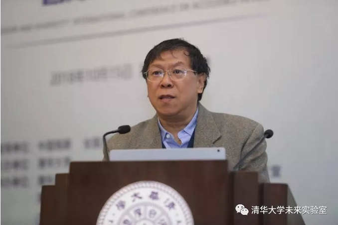
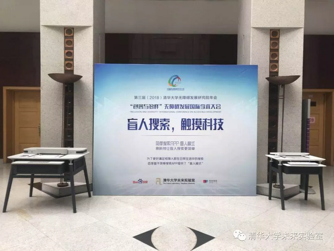
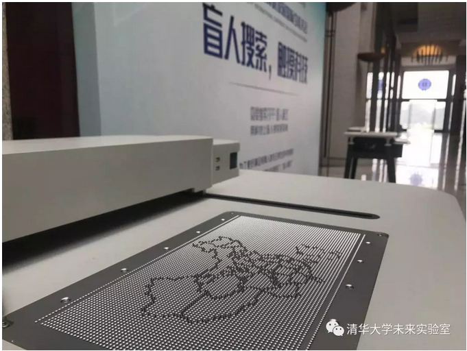
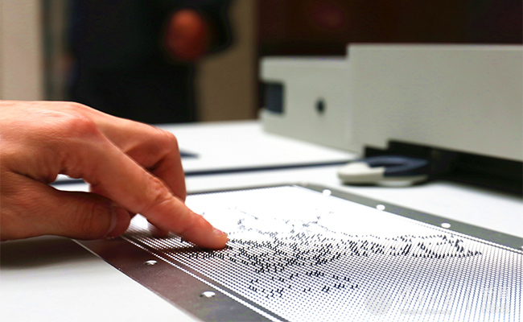
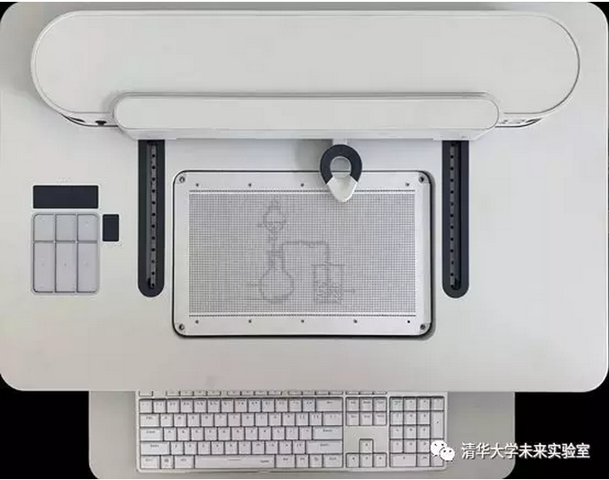
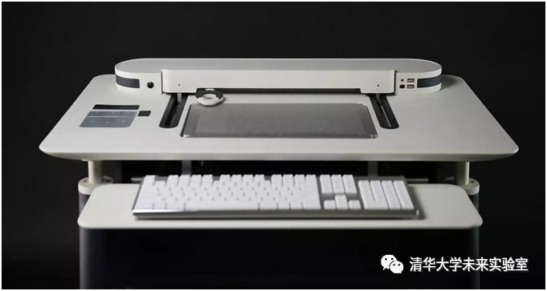

# iTalk

By Tingliang Zhang

## Large-format graphical tactile display terminal

http://thfl.tsinghua.edu.cn/info/yjxm/270

According to the World Health Organization's 2017 report, there are approximately 253 million visually impaired people worldwide, of which 36 million are totally blind individuals. The British Lancet magazine pointed out in 2017 that according to statistics from 1990 to 2015, with a growing and aging population,, by 2050, the number of blind people worldwide may increase to 115 million. This is a huge challenge for all human beings.

Because of impaired vision, blind people rely primarily on hearing and touch to obtain information. With the development of science and technology, the popularity of the Internet has enabled new opportunities for the blind to communicate with the outside world, and  choose a wider range of careers. However, a significant obstacle for blind people remains when visual information, such as pictures and videos, becomes the main source of information in knowledge dissemination, particularly on the Internet, where visual content is increasingly rich. Therefore, blind people urgently need barrier-free devices that can easily read image information.

The large-format tactile graphic display terminal research product is different from the traditional computer screen. The surface of the tactile graphic display terminal is composed of a lattice that can be raised and retracted. By controlling the changes in these lattices through the computer, traditional pictures can be turned into touchable graphics. Blind users can then read text and cognitive images by touching the braille or tactile graphics of these raised dots.

The development of this device can further promote the development of many accessible applications for blind users, such as the popularity of electronic braille books, online learning, shopping, and browsing for blind users, and makes it easier for blind people to learn graphical knowledge such as mathematical geometry, physical circuits, and chemical structures. In the future, blind people will not only read the text but also "see" the illustration when reading braille books.

The second-generation equipment prototype successfully developed by the R&D team uses a new self-locking mechanical structure designed to drive the rendering of tactile images,, with the advantages of low cost, scalability, and large format compatibility. Meanwhile, the device uses a time-sharing algorithm based on image semantics and an innovative tactile guidance mechanism to help blind users to more accurately recognize and understand images.

In response to the special needs of blind users, the R&D team also designed a multi-channel fusion interactive experience, which only provides tactile interaction, but also location-based 3D sound navigation and voice interaction. In terms of user experience design, the products considers the usage habits of blind people with electronic devices, and maximizes the interactive advantage of tactile dot matrix display to enable blind users “to get what they touch”. In addition, this prototype encapsulates the basic module of touch-hearing control and has a high degree of application scalability to support the basic operations of most web pages and applications.

http://thfl.tsinghua.edu.cn/info/pcbanner/451

October 15, 2018, the director of the Future Laboratory professor Yingqing Xu representing the develop team releases the prototype of the Large-format Graphical Tactile Display Terminal after years of research and development, on the “Inclusivity and Diversity” Barrier-free Development International Academic Assembly held by Tsinghua University for the White Cane Safety Day.

The Large-format Tactile Graphic Display Terminal research product is different from the traditional computer screen. The surface of the tactile graphic display terminal is composed of a lattice that can be raised and retracted. By controlling the changes in these lattices through the computer, traditional pictures can be turned into touchable graphics. Blind users can then read text and cognitive images by touching the braille or tactile graphics of these raised dots.

The Future Laboratory will keep working on in-depth study and exploration to develop more design for the blind. Professor Yingqing Xu wishes that the Lab could cooperate with more partners to substantialize the researches into mass product. In the near future, he hopes they could provide more accessible accessory equipment for the blind people to study, work and live a better life, letting them enjoy the knowledge and convenient of technology as well as rest of us.

